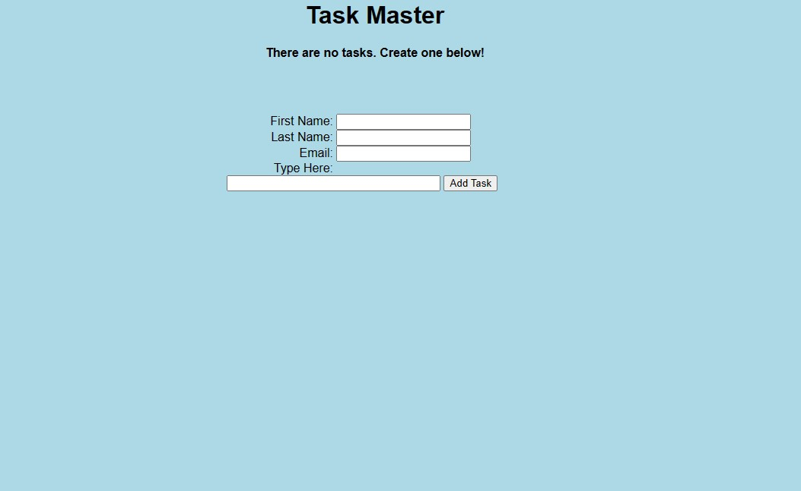

The Flask package in Python created this simple task manager app. It has a form for adding the inputs and the related tasks. This app uses the flask_sqlalchemy package to store the data in the instance folder as a .sqlite3 file.

